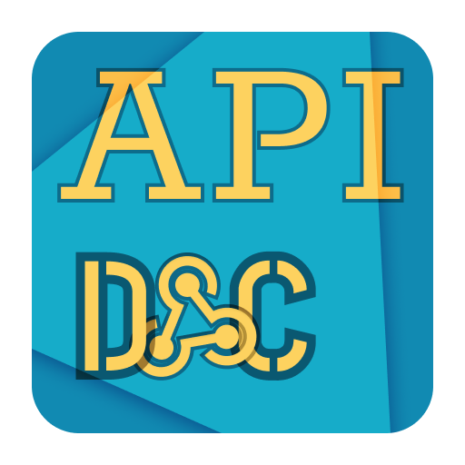
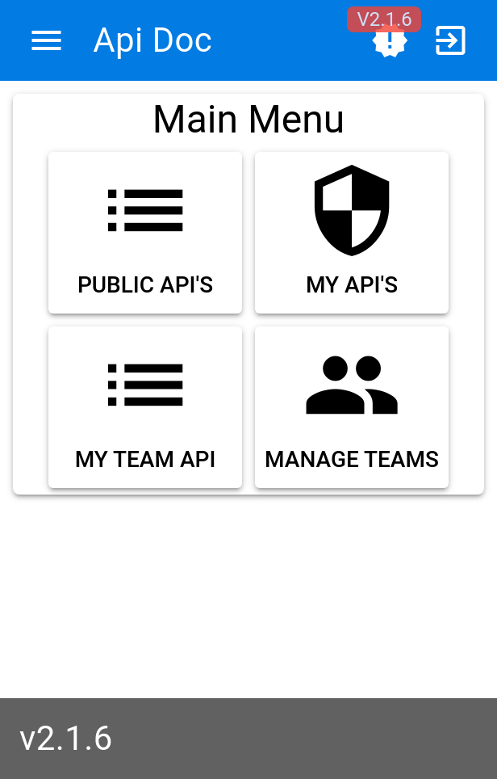
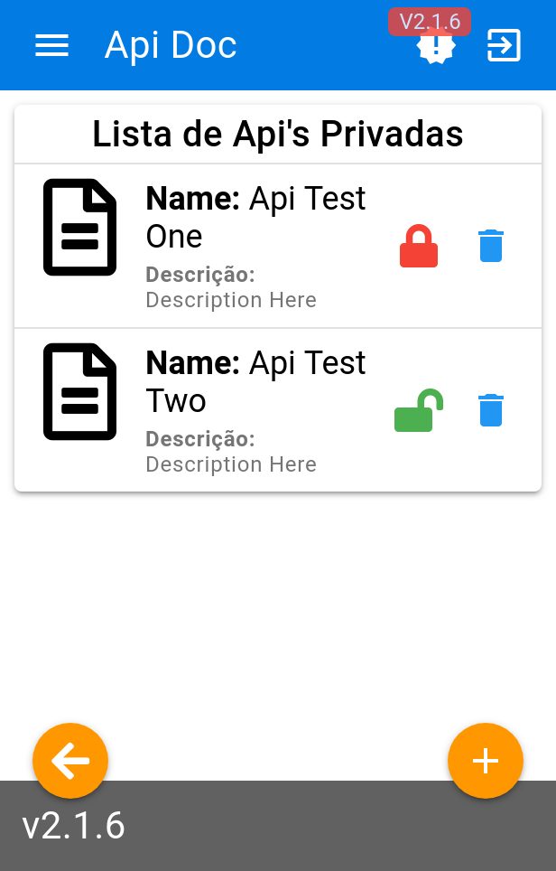
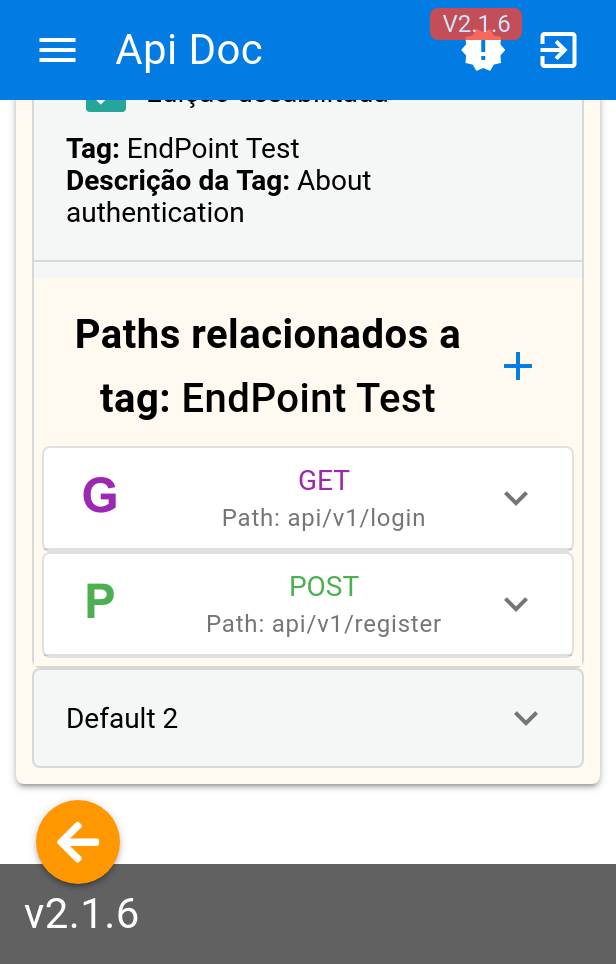
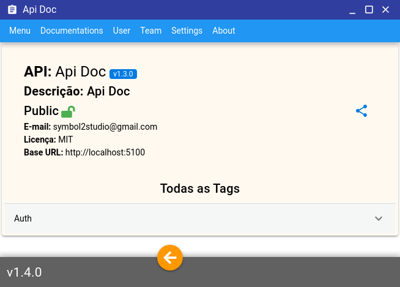

  

    
    
    
    
    
    
    
    
    

API Doc is an API Rest test technology, it works as a CRUD, where you can access the documentation from anywhere, I was inspired by applications like Swagger, Postman and Insonmia to create it.

### Mobile - (Cordova or PWA)

|              Main Menu              |              List Api               |                Paths                |
| :---------------------------------: | :---------------------------------: | :---------------------------------: |
|  |  |  |

### Client Electron for Desktop

> Attention: Cordova and Electron Builds ask for the address of a Remote API, they work only as customers, while the PWA version does not make this requirement, as it runs in the same container as the API - for more, see in docs ["Cordova And Electron Docs"](https://joaomede.github.io/Api-Doc/pages/CordovaAndElectron.html)

## Get Started

### See Full [Documentation](https://joaomede.github.io/Api-Doc)

### Need to get started fast? go docker [Docker Compose Settings](https://joaomede.github.io/Api-Doc/pages/Docker.html)

### Features

- [x] Dockerized? Yes!
- [x] Login and Register, Change Password
- [x] Team System
- [x] Api Documentation "private and public"
- [x] Client Electron for Windows, Mac And Linux Dist
- [x] PWA/SPA Works
- [ ] SSR Builder
- [x] Cordova Android
- [ ] Cordova iOS
- [x] Test Request
- [x] Register Responses and Codes Definitions
- [x] Methods Accept: Post, Get, Delete, Put
- [x] Accept: Headers, Params Path and Body
- [x] Accept: Query Params
- [ ] Accept: DataForm, in Dev

## License

[MIT](LICENSE)
