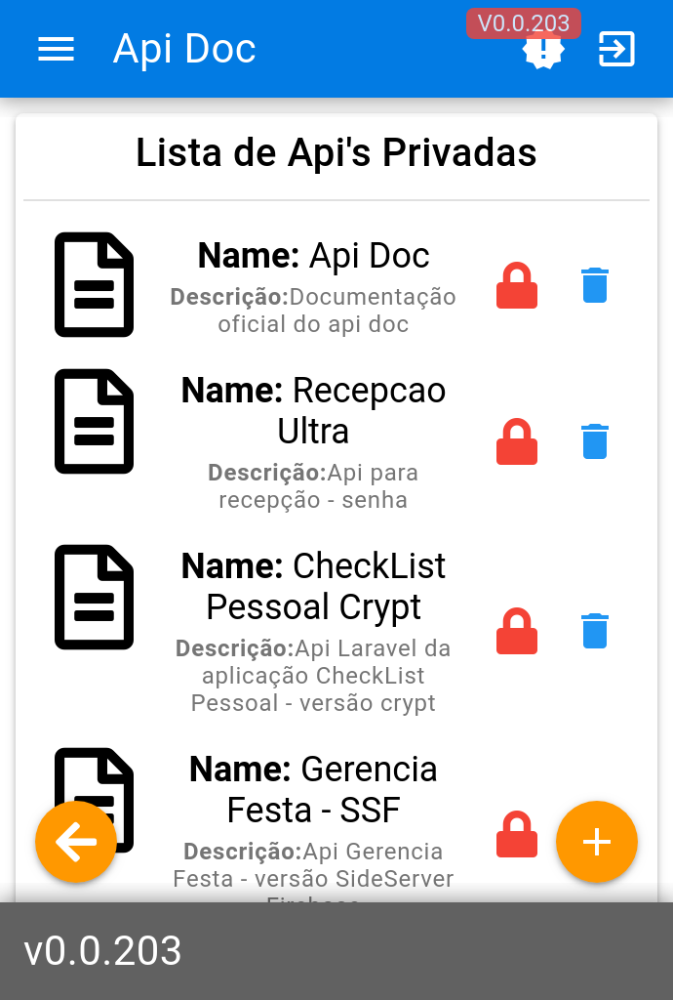
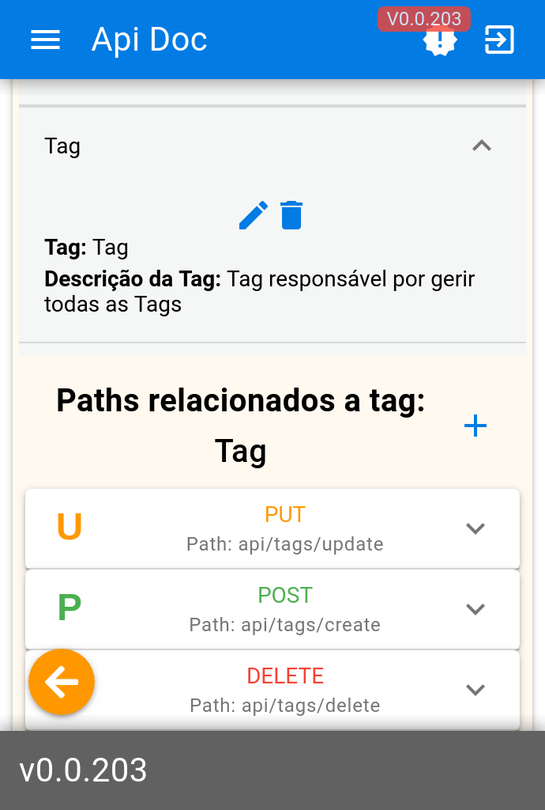

# Api Doc

Main Menu             |  List Api          |Paths
:-----------------------:|:-------------------------:|:-----------------------:
      |     | 


> Api doc is a CRUD api documenter, this system is part of my personal portfolio, but it was born out of a need to document my APIs and test it on one platform, any resemblance to swagger, insomnia or postman is not a conscience, I love it these applications and I was inspired by them to do the research needed to build "Api Doc"


### About NPM Libs

Some dependencies I would like to leave the reference and thanks

[Express](https://github.com/expressjs/express),
[Knex](https://github.com/knex/knex),
[Knex](https://github.com/knex/knex),
[Axios](https://github.com/axios/axios),
[Quasar Framework](https://github.com/quasarframework/quasar),
[vue-json-edit](https://github.com/jinkin1995/vue-json-edit),
[vue-json-pretty](https://leezng.github.io/vue-json-pretty),


### How to Serve
```shell
# Production with Docker

$ docker-compose up -d

# Development without Docker
$ yarn dev
# or
$ npm run dev
```

### How to Install
```shell
# Production with Docker

$ chmod 777 install.sh
$ ./install.sh

# Development without Docker
$ yarn install
$ cd view && yarn install
# or

$ yarn run install
$ cd view && yarn run install
```

### How to Build
```shell
# Production with Docker

$ chmod 777 build.sh
$ ./build.sh

# Development without Docker
$ yarn build
$ yarn build:pwa
```

### How to Migrate
```shell
# Production with Docker
# when you "./install.sh" migrate will be done

# Development without Docker
$ yarn migrate

# for down
$ yarn migratedown
```

### About Progress

- [x] Login and Register
- [x] Team System
- [x] Api Private
- [x] Api Public
- [x] Api In Team
- [x] Tags
- [x] Paths
- [x] Responses
- [x] Test Request
- [x] Post
- [x] Get
- [x] Delete
- [x] Put
- [ ] Patch
- [x] Send Headers on test
- [x] Send Body on test
- [x] Send Params on test
- [ ] Send DataForm on test
- [ ] Send Auth on test 

### Very important information
> I use a technology to manage development log versions, so in View will comment on line 44 where it has written "this.$store.dispatch ('versionCheck')"
