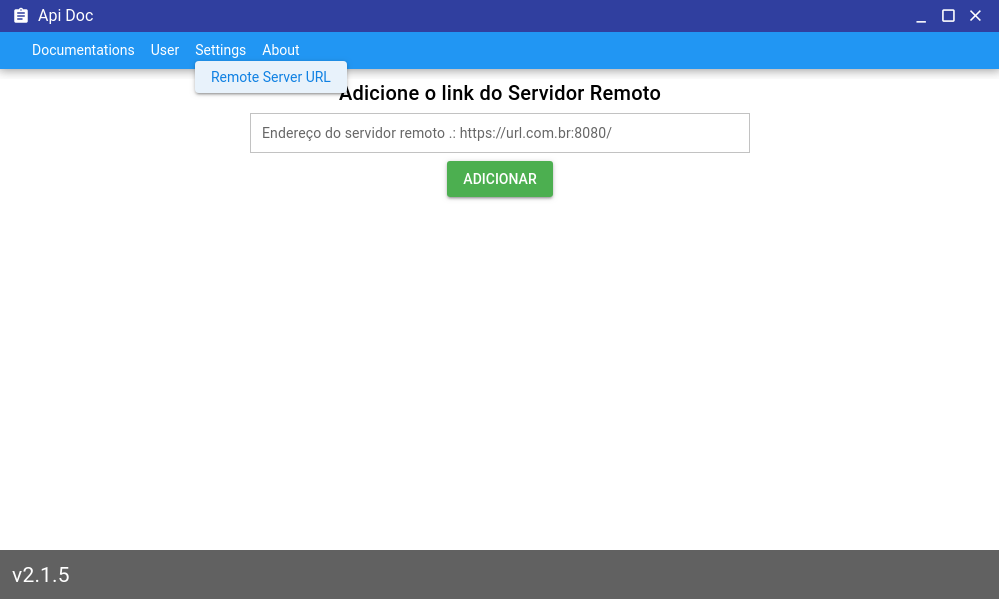

# Cordova And Electron

The project currently maintains versions of cordova and electron clients, where it is possible to point to a remote "API" server and consume the data in these clients, below are images that show the entry screen of the remote api's endpoint, needing to put the "/" at the end of the endpoint.

## Cordova

  

## Electron

  

## About Build
The project already has all the necessary configuration to build Cordova and Electorn, all the configuration for build is based on the Quasar.Dev setup, all scripts are available in the "view" folder, on package.json file, in case there are problems in these builds, the best way is check the official Quasar.Dev Documentations, in link [Quasar.Dev](https://quasar.dev/)